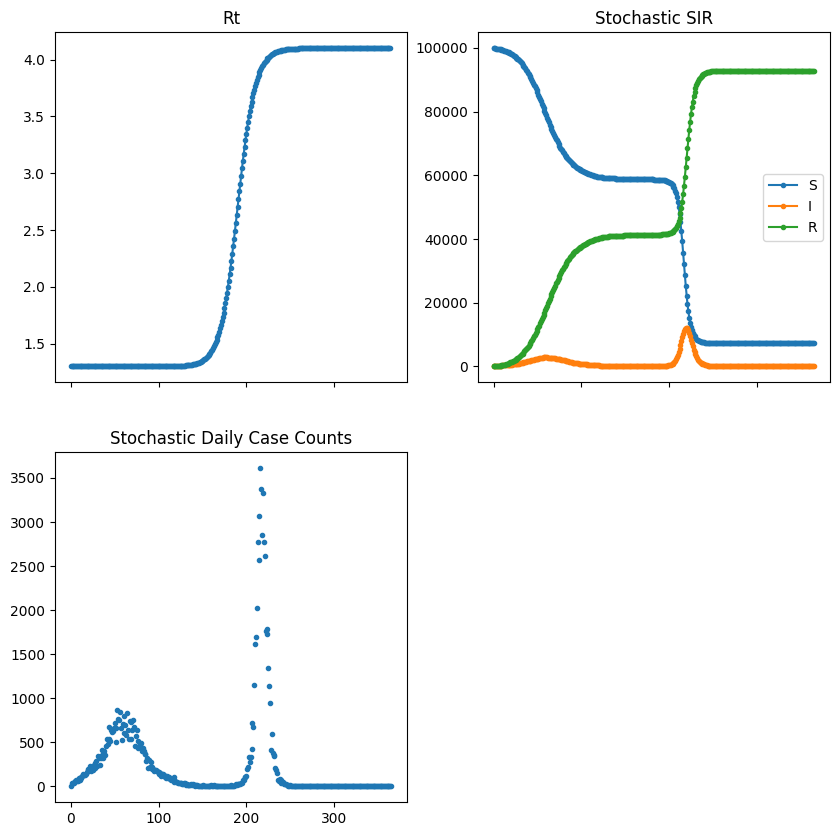
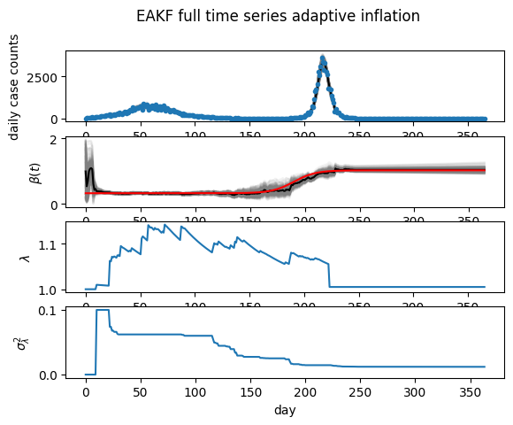

# epyfilter
[](https://opensource.org/licenses/MIT)

This repository contains the code and data used to generate the results and figures presented in "[Data assimilation for estimating change points of time-varying reproduction numbers]()" by Wunrow et al. (2024).

The manuscript compares five methods to estimate the time-varying basic reproduction number, $R_0(t)$, from synthetic data generated by a stochastic SIR model. We compare the Ensemble Adjustment Kalman Filter (EAKF) with no inflation, fixed inflation, and adaptive inflation, the Ensemble Square Root Smoother (EnSRS) with adaptive inflation, and the EpiEstim renewal equation approach. Our results demonstrate that the EAKF and EnSRS methods with adaptive inflation outperform other approaches in accurately capturing the true $R_0(t)$, particularly in scenarios with more abrupt changes in transmission rates.The code provided here allows for the reproduction of the experiments and analysis detailed in the paper.


## Installation
To set up the necessary environment, use conda:
```bash
conda env create -f environment.yml
```
Then, install the epyfilter package:

```
python setup.py install
```

## Directory Tree Structure
```
epyfilter/
│
├── src/epyfilter/
|   ├── eakf/                                          # EAKF, EnSRS, and adaptive inflation scripts
|   ├── epiestim/                                      # Epiestim parallelized scripts
|   ├── utils/                                         # Helper functions for performance metrics
|   ├── params/good_param_list.csv                     # Parameter values for all 47,871 scenarios
│   └── plot/                                          # Plotting code for all tables and figures
│
├── setup.py                                           # Setup file
├── environment.yml                                    # List of Python dependencies for conda
├── .flake8                                            # flake8 codestyle
└── README.md                                          # Project README file with an overview and setup instructions
```

## Usage
To reproduce all figures and tables run the following Jupyter notebook
```
src/epyfilter/plot/create_plots.ipynb
```

### Simulate Data
```
from epyfilter import simulate_data

params = {
    'rt_0': 1.3,
    'rt_1': 4.1,
    'midpoint': 190.,
    'k': 0.1,
    'n_t': 365,
    't_I': 4.,
    'N': 100_000.,
    'S0': 99_900.,
    'I0': 100.,
}

np.random.seed(1994)
data = simulate_data.simulate_data(**true_params, add_noise=True, noise_param=1/50)
data.plot_all()
```



### Run EAKF with adaptive inflation
```
from epyfilter import model_da
from epyfilter import eakf

from numpy.random import uniform

prior = {
    'beta':{
        'dist': uniform,
        'args':{
            'low': 0.1,
            'high': 2.,
        }
    },
    't_I':{
        'dist': "constant",
        # 'args':{
        #     'lower': 1.,
        #     'upper': 12.,
        # }
    },
}

model = model_da.SIR_model(data)
kf.filter(prior, inf_method="adaptive")
kf.plot_posterior()
```


## Contributing
Contributions to this repository are welcome. Please feel free to open issues for bug reports or feature requests. If you would like to contribute code, please fork the repository and submit a pull request.

